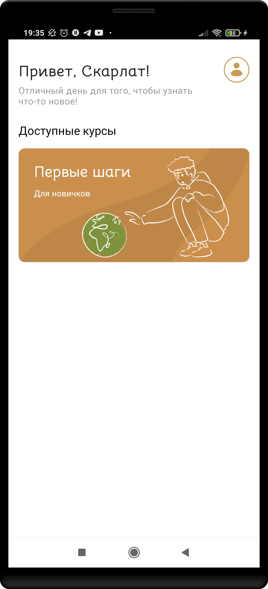

# 📱:earth_africa: EcoTips

### Overview

Application contains tips, which helps to planet. For example, aerator nozzle saves up to 50% of water consumption. This advice is very beneficial for a person, because water consumption is paid by the meter. On the other hand, less resource consumption is a concern for our planet.

The content, layout and app (Android OS) were created by our [team](#team).

## Project characteristics and tech-stack

* Tech-stack
    * [73,9% Kotlin](https://kotlinlang.org/) + [Coroutines](https://kotlinlang.org/docs/reference/coroutines-overview.html) - perform background operations
    * [Retrofit](https://square.github.io/retrofit/) - networking
    * [Jetpack](https://developer.android.com/jetpack)
        * [Navigation](https://developer.android.com/topic/libraries/architecture/navigation/) - in-app navigation
        * [LiveData](https://developer.android.com/topic/libraries/architecture/livedata) - notify views about database change
        * [Lifecycle](https://developer.android.com/topic/libraries/architecture/lifecycle) - perform an action when lifecycle state changes
        * [ViewModel](https://developer.android.com/topic/libraries/architecture/viewmodel) - store and manage UI-related data in a lifecycle conscious way
        * [Room](https://developer.android.com/jetpack/androidx/releases/room) - store offline cache
    * [Dagger 2](https://dagger.dev/) - dependency injection
    * [KotlinX Serialization](https://github.com/square/moshi) - JSON converter
* Architecture
    * Some activities architecture: authorization, launch, main, etc. ( with [Navigation component](https://developer.android.com/guide/navigation/navigation-getting-started))
    * MVVM (presentation layer)
    * [Android Architecture components](https://developer.android.com/topic/libraries/architecture) ([ViewModel](https://developer.android.com/topic/libraries/architecture/viewmodel), [LiveData](https://developer.android.com/topic/libraries/architecture/livedata), [Navigation](https://developer.android.com/jetpack/androidx/releases/navigation))
    * [Android KTX](https://developer.android.com/kotlin/ktx) - Jetpack Kotlin extensions
* UI
    * [Material design](https://material.io/design)

#### Team 
* Android:
    * [Skarlat Denis](https://github.com/bboyzlodey)
    * [Mikhail Tolstyh](https://github.com/drinko-dr)
* Design:
    * Kristina Shirokova
* Application content (main expert of EcoTips):
    * Anny Tompson

  
[Design Layout by Kristina Shirokova](https://www.figma.com/file/Oiu9ABno0485gtOYsX8Off/Eco-Cards?node-id=33%3A113)
